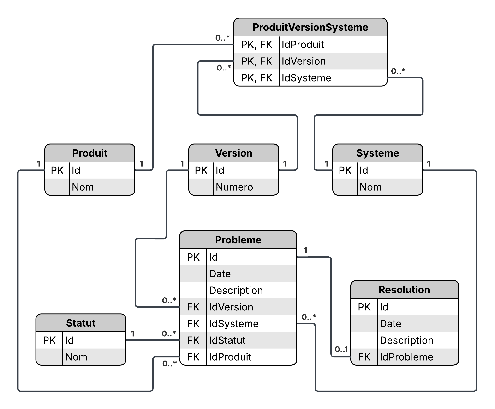

NexaWorks - Base de données de gestion de tickets

Cette base de données a été conçue pour assurer le suivi des problèmes rencontrés sur différents produits, leurs versions et les systèmes d’exploitation associés.

## Fonctionnalités principales :
- Base de données conçue via migrations Code First avec Entity Framework Core
- Assure le suivi des problèmes qui surviennent sur les produits
- Un produit peut avoir plusieurs versions, et chaque version peut être disponible sur plusieurs systèmes d'exploitation
- Chaque problème est lié à un produit, une version et un système d'exploitation
- Un problème peut être non résolu ou associé à une résolution
- La base contient 25 exemples de problèmes et leurs éventuelles résolutions
- Des requêtes LINQ permettent d’interroger la base selon plusieurs scénarios

## Modèle entité-association
Voici le modèle entité-association utilisé pour concevoir la base de données du projet :

## Requêtes LINQ
Les requêtes LINQ se trouvent dans le dossier : /Requetes_LINQ/

## Installation :
1. Cloner le dépôt : "git clone https://github.com/S-Marnat/OC-Projet6.git" ;
2. Ouvrir la solution "NexaWorks.slnx" dans Visual Studio ;
3. Restaurer les dépendances : "dotnet restore" ;
4. Vérifier la chaîne de connexion dans "appsettings.json".
  Par défaut, elle utilise le serveur local (".") et fonctionne sur toute installation Visual Studio.
  Modifier uniquement si nécessaire.

 "ConnectionStrings": {
    "DefaultConnection": "Server=.;Database=NexaWorks;Trusted_Connection=True;MultipleActiveResultSets=true;TrustServerCertificate=True;"
  }

5. Appliquer les migrations : "dotnet ef database update" ;
6. Ouvrir SSMS : la base de données est installée et prête à être exploitée.